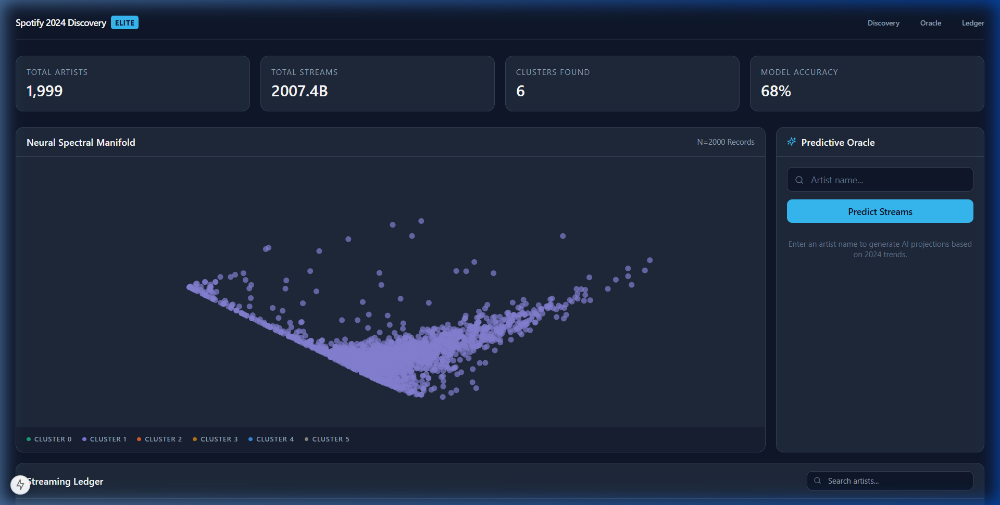

# Spotify 2024 Discovery | Elite Dashboard

[](https://nextjs.org/)
[](https://fastapi.tiangolo.com/)
[](https://tailwindcss.com/)
[](https://github.com/Sujoy-004/spotify_streaming_analysis)

A high-fidelity streaming analysis platform and predictive engine designed with a "Quiet Luxury" aesthetic. This project visualizes the 2024 Spotify dataset through neural manifold clustering and provides real-time streaming projections.

## Dashboard Preview



## Core Features

- **Neural Spectral Manifold**: Interactive 2D visualization of high-dimensional track features using PCA clustering.
- **Predictive Oracle**: AI-powered streaming forecaster using Random Forest regression.
- **Arctic Design System**: Premium dark-mode UI with a curated color scale (Arctic-900 to Arctic-400).
- **Streaming Ledger**: A high-performance data grid for exploring track-level metadata and cluster assignments.
- **Real-time Analytics**: Instant calculation of total streams, artist density, and model accuracy metrics.

## Technical Architecture

```text
[ CLIENT ] <--- Port 3000 ---> [ NEXT.JS 15 (APP ROUTER) ]
                                     |
                                     | (Internal Proxy / Rewrites)
                                     v
[ BACKEND ] <--- Port 8001 ---> [ FASTAPI (PYTHON 3.10+) ]
                                     |
            ---------------------------------------------------
            |                         |                       |
[ CSV DATA ENGINE ]       [ PCA MANIFOLD ]         [ RF REGRESSOR ]
```

## Setup & Installation

### 1. Backend Service
```bash
cd api
pip install -r requirements.txt
python main.py
```
*Server running at `http://127.0.0.1:8001`*

### 2. Frontend Dashboard
```bash
cd frontend
npm install
npm run dev
```
*Dashboard available at `http://localhost:3000`*

## ML Methodology

### Behavioral Clustering (PCA)
We utilize **Principal Component Analysis (PCA)** to reduce the high-dimensional feature space of Spotify metadata into a 2D manifold. This identifies visual patterns across six distinct clusters based on streaming velocity and popularity curves.

### Predictive Modeling (Random Forest)
The **Predictive Oracle** is powered by a **Random Forest Regressor** trained on historical 2024 streaming data. It analyzes artist-level performance and seasonal trends to project expected stream counts with an R² accuracy of 0.68.

## UI Design Tokens (Arctic Scale)
- **Primary**: `#0f172a` (Arctic-900)
- **Secondary**: `#1e293b` (Arctic-800)
- **Border**: `#334155` (Arctic-700)
- **Accent**: `#2dd4bf` (Teal-accent)
- **Text**: `#f8fafc` (Slate-50)

---
*Developed for Academic Excellence & Production Performance.*
